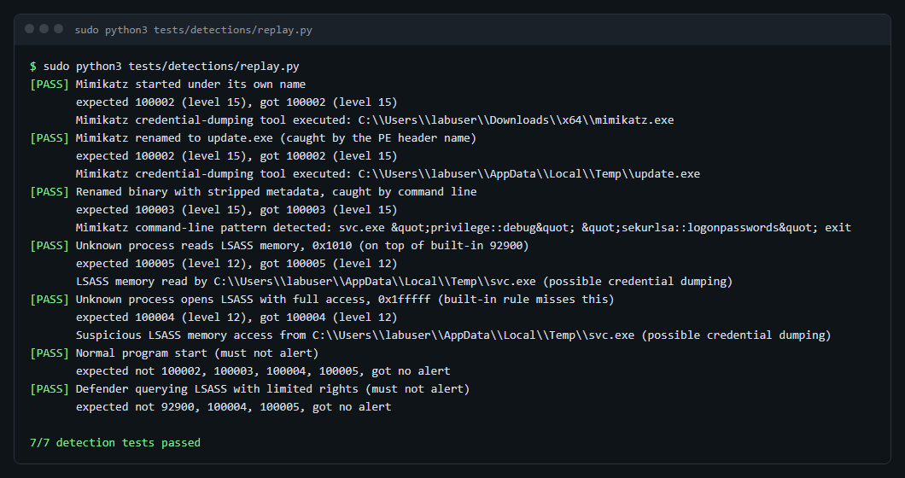

# 🛡️ SOC Automation Home Lab


A hands-on **Security Operations Centre** built from open-source tools, wiring
**detection → automation → enrichment → case management → response** into a single
end-to-end workflow. The lab detects a real attack (Mimikatz credential dumping) on a
Windows endpoint and automatically triages, enriches, documents and remediates it -
with a human analyst approving the destructive step.

## The task

> **Deploy a SIEM and catch something real.** Stand up Microsoft Sentinel or Wazuh,
> feed it logs, write one detection rule and make it fire.

What I did:

- Stood up **Wazuh** with Sysmon telemetry from a Windows endpoint, plus Shuffle and TheHive for the response side.
- Wrote **four custom rules** for credential dumping (Mimikatz, MITRE T1003.001).
- **Made them fire** against a real Wazuh 4.14 manager with a replay test, which runs in GitHub Actions on every change. The test found a real bug in one of my rules (see *What surprised me*).
- Made the whole lab deployable on **Azure** with Terraform, so it can be brought up, attacked and torn down in an afternoon.



## Architecture

The architecture was designed up front (in draw.io) so each component's role and the
event flow were clear before building.


Events flow through eight steps, from endpoint telemetry to automated response:


| # | Step | Component |
|---|---|---|
| 1 | Send events | Windows 10 + Wazuh Agent + Sysmon |
| 2 | Receive & detect | Wazuh Manager + custom rules |
| 3 | Forward alerts | Wazuh → Shuffle webhook |
| 4 | Enrich IOCs | Shuffle → VirusTotal (OSINT) |
| 5 | Create case | Shuffle → TheHive |
| 6 | Notify analyst | Shuffle → Email |
| 7 | Review & decide | SOC analyst |
| 8 | Respond | Shuffle → Wazuh API → remove threat on endpoint |

## Tech stack

| Layer | Tool |
|---|---|
| Endpoint telemetry | **Sysmon** |
| SIEM / detection | **Wazuh** (manager, indexer, dashboard) |
| SOAR / automation | **Shuffle** |
| Threat intel | **VirusTotal** API |
| Case management | **TheHive** |
| Response | **Wazuh Active Response** (PowerShell) |

## Detection use case: Mimikatz (T1003.001)

The reference detection is **Mimikatz credential dumping**, a technique in a large
share of real intrusions. The custom Wazuh rules
([`wazuh/manager/local_rules.xml`](wazuh/manager/local_rules.xml)) catch it three ways:

- **OriginalFileName** from the PE header (Sysmon Event ID 1) - fires even if the
  attacker renames `mimikatz.exe`,
- **command-line keywords** (`sekurlsa::logonpasswords`, `lsadump::sam`, …),
- **suspicious LSASS memory access** (Sysmon Event ID 10) - catches renamed / in-memory variants.
  Rule 100005 builds on Wazuh's own rule 92900, and 100004 covers the access masks 92900 misses.

A level-15 alert triggers the whole automation chain.

### Testing the rules

[`tests/detections/replay.py`](tests/detections/replay.py) sends seven Sysmon events into a
real Wazuh manager the same way an agent does and checks which rule fired. Five should alert,
two are normal activity that must **not** alert. The
[Detection tests](.github/workflows/detections.yml) workflow installs Wazuh on a GitHub runner
and runs them on every change to the rules.

```bash
sudo install -o wazuh -g wazuh -m 660 wazuh/manager/local_rules.xml /var/ossec/etc/rules/
sudo /var/ossec/bin/wazuh-control restart
sudo python3 tests/detections/replay.py      # 7/7 detection tests passed
```

## What's in this repo

```
├── images/              architecture & workflow diagrams (draw.io)
├── docs/                step-by-step build guide
│   ├── 01-architecture.md
│   ├── 02-wazuh-manager-setup.md
│   ├── 03-windows-agent-sysmon.md
│   ├── 04-detection-mimikatz.md
│   ├── 05-shuffle-automation.md
│   ├── 06-thehive-case-management.md
│   └── 07-active-response.md
├── wazuh/
│   ├── manager/         custom detection rules + ossec.conf integration snippets
│   └── agent/           agent config + the remove-threat active-response script
├── shuffle/             the SOAR workflow, node by node, with request bodies
├── playbooks/           incident-response playbook for the detection
├── tests/detections/    replay test: sample Sysmon events -> real Wazuh -> expected rule
└── deploy/              infrastructure as code: Azure or DigitalOcean Terraform + setup.sh
```

## Deploy it

**Azure (recommended, works with Azure for Students)** - one Linux server and one Windows
endpoint in a private network, dashboards open only to your IP, auto-shutdown every evening:

```bash
az login
cd deploy/azure && cp terraform.tfvars.example terraform.tfvars   # set my_ip
terraform init && terraform apply
# then follow the printed next steps; on the endpoint run deploy/azure/endpoint-setup.ps1
terraform destroy
```

**DigitalOcean** - the original option, server only. See **[deploy/README.md](deploy/README.md)**:

```bash
cd deploy/terraform && terraform apply      # provision the VM + firewall
ssh root@<server-ip>
cd /opt/SOC-Automation-Home-Lab/deploy && sudo ./setup.sh   # Wazuh + Shuffle + TheHive
terraform destroy                           # when done, to stop cloud charges
```

The stack needs ~16 GB RAM, so it runs on a cloud VM; the spin-up → test → destroy
pattern keeps the cost to a few dollars.

**Manual** - follow the guides in order, starting with
**[docs/01-architecture.md](docs/01-architecture.md)**. In short:

1. Stand up the **Wazuh Manager** and load the custom rules.
2. Install **Sysmon** + the **Wazuh Agent** on an isolated Windows 10 VM.
3. Confirm the **Mimikatz detection** fires.
4. Build the **Shuffle** workflow (webhook → VirusTotal → TheHive → email → approval → response).
5. Stand up **TheHive** for case management.
6. Trigger the attack and watch it get detected, enriched, cased, and remediated.

> ⚠️ The detection test runs real credential-dumping tooling. Do it **only** on an
> isolated lab VM with a snapshot to restore - never on a production or personal machine.

## Design decisions

- **Detection-as-code** - the rules live in version control, not clicked into a UI, so
  they're reviewable and reproducible.
- **OriginalFileName over image name** - renaming the binary is the most common, laziest
  evasion; matching PE metadata defeats it.
- **Human-in-the-loop response** - step 8 deletes files, so it waits for analyst approval.
  Fully automatic destructive actions are how automation causes its own incidents.
- **Enrich before escalating** - VirusTotal filters out noise so the analyst only sees
  confirmed-malicious hashes.

## What I learned

- Building a virtual detection lab from scratch with open-source tools
- Writing custom Wazuh rules mapped to MITRE ATT&CK
- Using Sysmon logs (Event ID 1 and 10) to detect credential dumping
- Analyzing security logs to investigate suspicious activity
- Automating alert enrichment and case creation in Shuffle and TheHive
- Keeping a human approval step before any automated response
- Responding to realistic incidents and writing reports based on the SANS IR phases
- Deploying the lab with Terraform and Docker
- Testing detection rules automatically against a real SIEM instead of trusting that they work

## What surprised me

- **One of my rules never fired.** Rule 100004 (LSASS memory read) looked correct, but Wazuh's
  built-in rule 92900 matches the same event first, and Wazuh only follows one branch. My rule was
  never evaluated. I only found out because the test checked *which* rule fired, not just "some alert".
- **Wazuh's own test tool cannot test Windows rules.** `wazuh-logtest` sends every event through the
  syslog path, so Windows events never reach the eventchannel decoder. I had to read the Wazuh source
  to see why, then send events the way an agent does.
- Small format details matter: the decoder only accepted the event XML with single-quoted attributes,
  exactly as Windows writes it. With double quotes it failed silently.

## What I'd do differently

- Run the full lab on Azure and add screenshots of the alert in Wazuh, the case in TheHive and the
  Shuffle run. The rules are proven by the tests, the end-to-end automation still needs that proof.
- Write rules in **Sigma** first and convert them to Wazuh, so the same detection could move to
  Sentinel or Splunk.
- Add more negative test cases from a real, busy Windows machine. Two benign events is not enough
  to know the false-positive rate.

## Inspiration

The lab architecture was inspired by [MyDFIR](https://www.youtube.com/@MyDFIR)'s
["SOC Automation Project"](https://www.youtube.com/watch?v=ahrSFdiWzis) series. I used it
as a starting point, then built out the detection rules, Shuffle workflow, playbook and the
Terraform/Docker deployment myself.

## Credits

- [Wazuh](https://wazuh.com/) · [Shuffle](https://shuffler.io/) · [TheHive](https://thehive-project.org/) · [Sysmon](https://learn.microsoft.com/sysinternals/downloads/sysmon) · [MITRE ATT&CK](https://attack.mitre.org/)

Made by **Talha Aker**.
