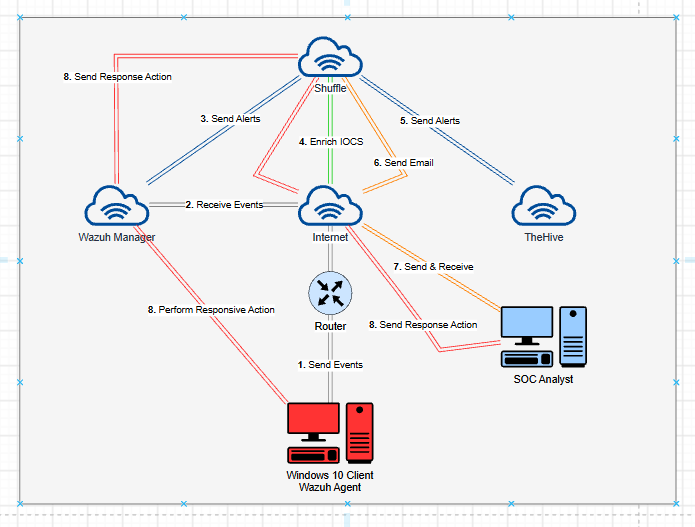
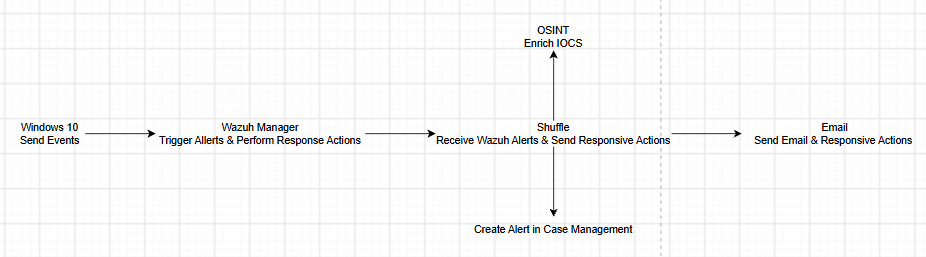

# 1. Architecture & Event Flow

The lab simulates a small Security Operations Centre. A monitored Windows endpoint
generates telemetry, Wazuh detects malicious activity, and Shuffle automates the
triage, enrichment, case creation and response.

## Components

| Component | Role | Runs on |
|---|---|---|
| **Windows 10 Client** | Monitored endpoint. Runs the Wazuh Agent and Sysmon. The "victim" we attack to test detections. | VM |
| **Wazuh Manager** | Collects agent events, applies detection rules, raises alerts, exposes the API used for active response. | Cloud / VM (Ubuntu) |
| **Shuffle** | SOAR. Receives alerts, enriches IOCs, creates cases, emails the analyst, triggers response. | Cloud / VM (Docker) |
| **TheHive** | Case management. Holds alerts and observables for the analyst to investigate. | Cloud / VM (Docker) |
| **SOC Analyst** | The human in the loop. Reviews the case and approves remediation. | Workstation |

## Event flow (the numbered steps on the diagram)

1. **Send Events** - the Wazuh Agent ships Sysmon/Windows events to the manager.
2. **Receive Events** - the manager decodes them and evaluates detection rules.
3. **Send Alerts** - alerts at level ≥ 12 are forwarded to the Shuffle webhook.
4. **Enrich IOCs** - Shuffle looks the file hash up on VirusTotal (OSINT).
5. **Send Alerts** - if malicious, Shuffle creates a case in TheHive.
6. **Send Email** - Shuffle emails the SOC analyst with the details.
7. **Send & Receive** - the analyst reviews the case and decides.
8. **Send Response Action** - on approval, Shuffle calls the Wazuh API, which tells
   the agent to remove the malicious file from the endpoint.

## Detection use case

The lab's reference detection is **Mimikatz credential dumping** (MITRE ATT&CK
[T1003.001](https://attack.mitre.org/techniques/T1003/001/)) - one of the most common
post-exploitation techniques. The detection, automation and response are all built
and tested end to end around this scenario, and the same pattern extends to any other
Wazuh rule by changing the rule and the Shuffle enrichment.
